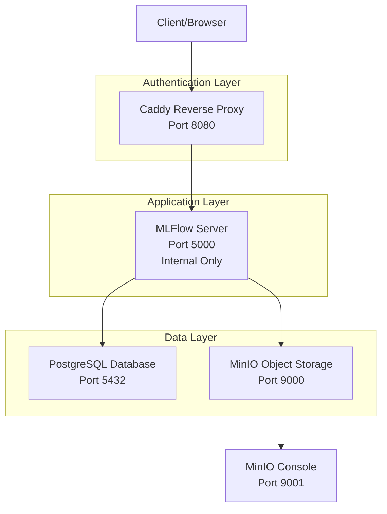

# MLFlow Stack for Railway

[](https://railway.app/template/railway-mlflow-stack)

Deploy a complete MLFlow machine learning tracking platform with PostgreSQL backend, MinIO object storage, and Caddy authentication gateway.

## About MLFlow

MLFlow is an open-source platform for managing machine learning experiments, models, and deployments. This template provides a production-ready MLFlow deployment with:

- **Experiment Tracking** - Log parameters, metrics, and artifacts for ML experiments
- **Model Registry** - Version and manage ML models with lifecycle stages
- **S3-Compatible Storage** - MinIO provides scalable artifact storage
- **Secure Authentication** - Caddy proxy handles authentication and SSL

## Common Use Cases

- **ML Experiment Management** - Track and compare machine learning experiments across teams
- **Model Versioning** - Manage model lifecycles from development to production
- **Collaborative ML** - Share experiments and models across data science teams
- **MLOps Pipelines** - Integrate with CI/CD for automated model deployment

## Dependencies

This template includes four containerized services:

- **MLFlow Server** - Experiment tracking and model registry
- **PostgreSQL** - Backend database for metadata storage  
- **MinIO** - S3-compatible object storage for artifacts
- **Caddy** - Reverse proxy with authentication

## Architecture



## Implementation Details

### Authentication Strategy

MLFlow's built-in authentication is experimental and not recommended for production. This template uses **Caddy as an authentication gateway** to provide:

- **Production-grade security** with bcrypt password hashing
- **Automatic HTTPS** and SSL certificate management  
- **Security headers** (XSS protection, HSTS, clickjacking prevention)
- **Request logging** and rate limiting capabilities

Railway automatically generates secure credentials (`AUTH_USERNAME` and `AUTH_PASSWORD`) for your deployment.

### Service Configuration

| Service | Purpose | Port | Access |
|---------|---------|------|--------|
| Caddy | Authentication gateway | 8080 | External (Railway domain) |
| MLFlow | ML tracking server | 5000 | Internal only |
| PostgreSQL | Metadata database | 5432 | Internal only |
| MinIO | Object storage | 9000/9001 | Internal + Console |

### Environment Variables

Railway automatically configures these variables:

- `AUTH_USERNAME` - Basic auth username (auto-generated)
- `AUTH_PASSWORD` - Basic auth password (auto-generated)
- `DB_URL` - PostgreSQL connection string
- `MLFLOW_S3_ENDPOINT_URL` - MinIO endpoint for artifacts

Optional OAuth2 configuration:
- `OAUTH2_CLIENT_ID` - OAuth2 client ID
- `OAUTH2_CLIENT_SECRET` - OAuth2 client secret

## Getting Started

Once deployed, access your MLFlow instance at your Railway-provided URL using the auto-generated credentials.

### Python Client Usage

```python
import mlflow

# Set tracking URI to your Railway domain
mlflow.set_tracking_uri("https://your-app.railway.app")

# Track an experiment
with mlflow.start_run():
    mlflow.log_param("alpha", 0.5)
    mlflow.log_metric("rmse", 0.8)
    mlflow.sklearn.log_model(model, "model")
```

### Model Registry

```python
# Register a model
mlflow.register_model("runs:/<run_id>/model", "MyModel")

# Load a model
model = mlflow.sklearn.load_model("models:/MyModel/1")
```

## Local Development

```bash
git clone <repository-url>
cd railway-mlflow-stack
docker-compose up -d
```

Access locally at `http://localhost:8080` (admin/changeme)

---

*This template was created for the [Railway MLFlow bounty](https://station.railway.com/questions/template-request-m-lflow-c7d942b1)*
